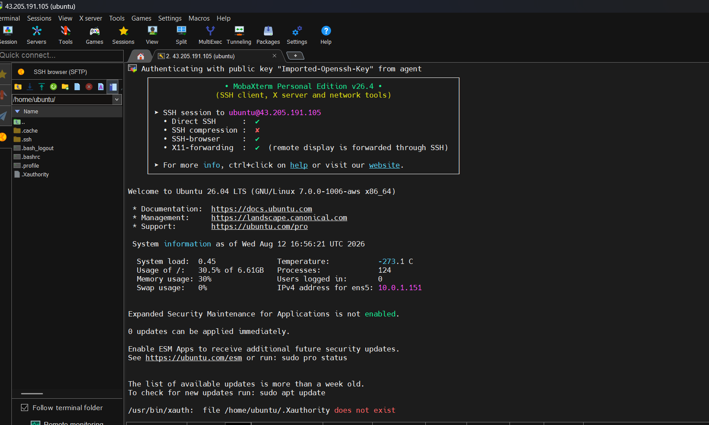
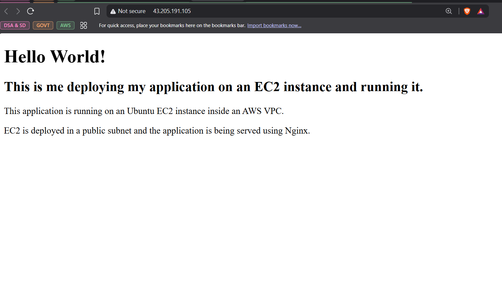

# AWS VPC + EC2 Static HTML Application

---

## Architecture

```text
Internet
   │
   ▼
Internet Gateway
   │
   ▼
Public Route Table
   │
   ▼
Public Subnet
10.0.1.0/24
   │
   ▼
Ubuntu EC2
   │
   ▼
Nginx :80
   │
   ▼
index.html
```


Private subnet created separately:

```text
10.0.2.0/24
```

---

## AWS Configuration

| Resource | Configuration |
|---|---|
| VPC | `10.0.0.0/16` |
| Public Subnet | `10.0.1.0/24` |
| Private Subnet | `10.0.2.0/24` |
| EC2 | Ubuntu |
| EC2 Private IP | `10.0.1.151` |
| EC2 Public IP | `43.205.191.105` |
| Internet Gateway | Attached to VPC |
| Web Server | Nginx |

---

## Route Tables

### Public Route Table

```text
10.0.0.0/16 → local
0.0.0.0/0   → Internet Gateway
```

### Private Route Table

```text
10.0.0.0/16 → local
```

The public subnet has Internet access through the Internet Gateway, while the private subnet has no direct Internet Gateway route.

---

## Security Group

```text
SSH   : TCP 22 → My IP
HTTP  : TCP 80 → 0.0.0.0/0
```

SSH was restricted to my IP, while HTTP was allowed for public web access.

---

## EC2 + Nginx

Connected to Ubuntu EC2 using **MobaXterm** over SSH.



### Install Nginx

```bash
sudo apt update
sudo apt install nginx -y
sudo systemctl enable nginx
sudo systemctl start nginx
```

### Verify

```bash
sudo systemctl status nginx
sudo ss -tulpn | grep :80
```

---

## HTML Application

Application location:

```text
/var/www/html/index.html
```

```html
<!DOCTYPE html>
<html>
<head>
    <title>My First AWS Application</title>
</head>
<body>
    <h1>Hello World!</h1>

    <h2>
        This is me deploying my application on an EC2 instance and running it.
    </h2>

    <p>
        Running on Ubuntu EC2 inside an AWS VPC using Nginx.
    </p>
</body>
</html>
```

---

## Testing

Test locally from EC2:

```bash
curl http://localhost
```

Verify Nginx:

```bash
sudo systemctl status nginx
```

Verify port 80:

```bash
sudo ss -tulpn | grep :80
```

Application URL:

```text
http://43.205.191.105
```


---

## Traffic Flow

```text
Browser
   ↓
Internet
   ↓
Internet Gateway
   ↓
Route Table
   ↓
Public Subnet
   ↓
EC2
   ↓
Security Group :80
   ↓
Nginx
   ↓
HTML
```

---

## Key Learnings

- **VPC** → Overall AWS network
- **Subnet** → Smaller network inside VPC
- **Route Table** → Determines where traffic goes
- **Internet Gateway** → Connects VPC to Internet
- **Security Group** → Controls allowed traffic
- **EC2** → Virtual server
- **Nginx** → Web server
- **HTML** → Application

---
