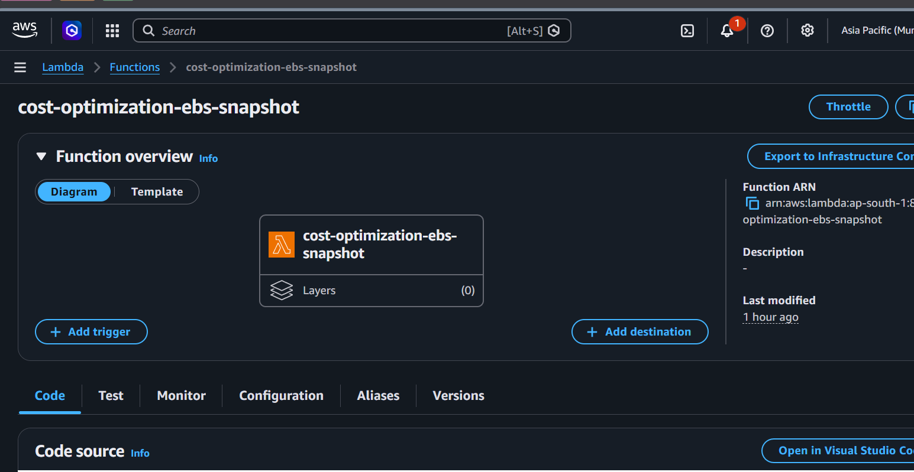
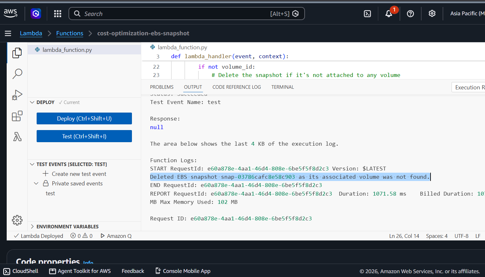
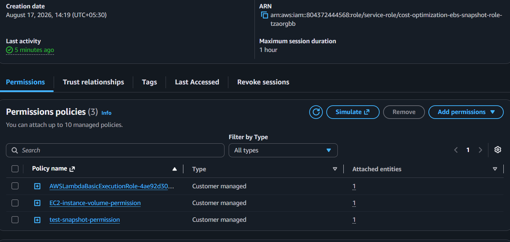

# AWS Cloud Cost Optimization – Identifying Stale EBS Snapshots

## Overview

This project implements an **AWS Lambda-based cost optimization solution** to identify and delete **stale EBS snapshots** that are no longer associated with active EC2 instances.

EBS snapshots consume AWS storage and can continue generating costs even after their related EC2 resources are no longer in use. This automation helps reduce unnecessary storage costs by identifying snapshots that are no longer required.

## Architecture

```text

                    ┌─────────────────────┐
                    │    AWS Lambda       │
                    │  Cost Optimization  │
                    └──────────┬──────────┘
                               │
                 ┌─────────────┴─────────────┐
                 ▼                           ▼
        ┌─────────────────┐         ┌─────────────────┐
        │   EC2 Instances │         │  EBS Snapshots  │
        │ Running/Stopped │         │   Owned by Self │
        └────────┬────────┘         └────────┬────────┘
                 │                           │
                 └─────────────┬─────────────┘
                               ▼
                    ┌─────────────────────┐
                    │ Identify Stale      │
                    │ Snapshots            │
                    └──────────┬──────────┘
                               │
                               ▼
                    ┌─────────────────────┐
                    │ Delete Unused       │
                    │ EBS Snapshots       │
                    └─────────────────────┘
```

## How It Works

1. The Lambda function retrieves all **EBS snapshots owned by the AWS account**.
2. It retrieves EC2 instances in the account, including:

   * `running`
   * `stopped`
3. For each snapshot, the function checks its associated EBS volume.
4. It determines whether the volume is associated with an active EC2 instance.
5. If the snapshot is identified as **stale/unnecessary**, the Lambda function deletes it.
6. This reduces unused EBS snapshot storage and helps optimize AWS costs.

## AWS Services Used

* **AWS Lambda** – Runs the cleanup automation.
* **Amazon EC2** – Used to identify instance and EBS volume relationships.
* **Amazon EBS** – Snapshot storage being analyzed and cleaned.
* **AWS IAM** – Provides Lambda with the required permissions.
* **Amazon EventBridge** *(optional)* – Can be used to schedule the Lambda function periodically.

## Key Concepts

### Stale EBS Snapshot

A snapshot is considered stale when it is no longer required by the infrastructure and its associated EBS volume is not being used by an active EC2 instance.

### Cost Optimization

Removing unnecessary snapshots helps reduce:

* EBS snapshot storage costs
* Accumulation of unused cloud resources
* Manual cloud infrastructure maintenance

## Cleanup Logic

```text
Get EBS Snapshots
       │
       ▼
Get EC2 Instances
       │
       ▼
For Each Snapshot
       │
       ▼
Check Associated Volume
       │
       ▼
Is Volume Associated
with an Active Instance?
      / \
    Yes  No
    │     │
    ▼     ▼
  Keep   Delete
 Snapshot Snapshot
```

## IAM Permissions

The Lambda execution role requires appropriate permissions to:

* Describe EC2 instances
* Describe EBS volumes
* Describe EBS snapshots
* Delete EBS snapshots

> **Important:** Automated deletion of snapshots is potentially destructive. In a production environment, additional safeguards such as tagging, retention policies, age thresholds, backups, and dry-run validation should be implemented before enabling automatic deletion.



Lambda function


Working result


Policies attached


## What I Learned

* AWS Lambda automation
* EC2 and EBS resource relationships
* Cloud cost optimization
* AWS IAM permissions
* Identifying unused cloud resources
* Automating infrastructure maintenance
* Using AWS APIs through Lambda

## Project Outcome

Successfully built a serverless AWS automation workflow that analyzes EBS snapshots, identifies potentially stale resources, and removes unnecessary snapshots to help **reduce cloud storage costs and improve resource hygiene**.


